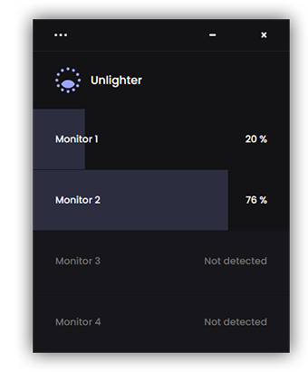

### Hi there ! 👋

My name is Donovan, I am a web and software developer. I also have a strong interest for UI/UX Design.

I enjoy working with new technologies, programming languages, and frameworks. I have a special attachment to **Javascript** and **VueJS**. I also work with **Figma** or **Photoshop** for designing or prototyping my websites and apps. I am currently learning **Typescript** and **Three.JS** (3D rendering with Javascript).

## Current Projects 

### Unlighter 💡 🖥️

By far my biggest project, [Unlighter](https://unlighter.app/) is a free an open-source software that helps you reduce your screens brightness. It can work with every type of screens (laptop screen, or plugged monitors), up to 4 screens at the same time.

You can learn more about it on the dedicated [Github Unlighter Repo](https://github.com/Dono7/Unlighter).

You can also visit the website to **download the app** or try an **online demo** : 
https://unlighter.app/

This project is build using **Vue 3** and **Electron JS v15**. The website is also made with **Vue 3**, and deployed with **Google Firebase**. The first "official public version" was released in October 2021.

### Minesweeperjs 💣 💥

I started developing [minesweeperjs](https://github.com/Dono7/MinesweeperJS) in 2020, a javascript package that contains to logic of the Minesweeper game. The package is available on NPM or usable in the browser via a CDN.

# Reach me 📫

You can contact me via my [Linkedin Profile](https://www.linkedin.com/in/donovan-trinh/).

<!--
**Dono7/Dono7** is a ✨ _special_ ✨ repository because its `README.md` (this file) appears on your GitHub profile.

Here are some ideas to get you started:

- 🔭 I’m currently working on ...
- 🌱 I’m currently learning ...
- 👯 I’m looking to collaborate on ...
- 🤔 I’m looking for help with ...
- 💬 Ask me about ...
- 📫 How to reach me: ...
- 😄 Pronouns: ...
- ⚡ Fun fact: ...
-->
